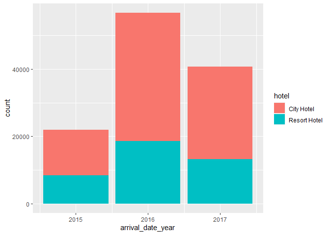
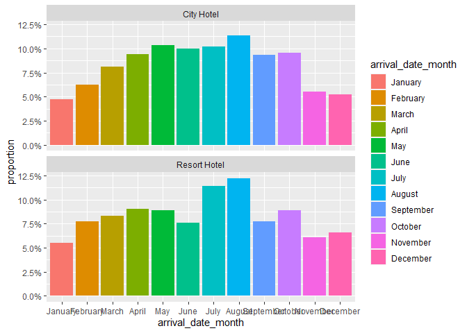

Hotel Bookings Analysis
================
2022-08-26

### Content

Analysis of hotel data which contains booking information for a city
hotel and a resort hotel, and includes information such as when the
booking was made, length of stay, the number of adults, children, and/or
babies, and the number of available parking spaces, among other things.

This data set contains a single file which compares various booking
information between two hotels: a **city hotel** and a **resort hotel**.

**Load Packages**

``` r
library(tidyverse)
```

    ## -- Attaching packages --------------------------------------- tidyverse 1.3.1 --

    ## v ggplot2 3.3.5     v purrr   0.3.4
    ## v tibble  3.1.6     v dplyr   1.0.8
    ## v tidyr   1.1.4     v stringr 1.4.0
    ## v readr   2.1.1     v forcats 0.5.1

    ## -- Conflicts ------------------------------------------ tidyverse_conflicts() --
    ## x dplyr::filter() masks stats::filter()
    ## x dplyr::lag()    masks stats::lag()

**Import data**

``` r
hotel_data <- read_csv("Data/hotel_bookings.csv")
```

    ## Rows: 119390 Columns: 32
    ## -- Column specification --------------------------------------------------------
    ## Delimiter: ","
    ## chr  (13): hotel, arrival_date_month, meal, country, market_segment, distrib...
    ## dbl  (18): is_canceled, lead_time, arrival_date_year, arrival_date_week_numb...
    ## date  (1): reservation_status_date
    ## 
    ## i Use `spec()` to retrieve the full column specification for this data.
    ## i Specify the column types or set `show_col_types = FALSE` to quiet this message.

**Data frame summaries**

``` r
head(hotel_data)
```

    ## # A tibble: 6 x 32
    ##   hotel is_canceled lead_time arrival_date_ye~ arrival_date_mo~ arrival_date_we~
    ##   <chr>       <dbl>     <dbl>            <dbl> <chr>                       <dbl>
    ## 1 Reso~           0       342             2015 July                           27
    ## 2 Reso~           0       737             2015 July                           27
    ## 3 Reso~           0         7             2015 July                           27
    ## 4 Reso~           0        13             2015 July                           27
    ## 5 Reso~           0        14             2015 July                           27
    ## 6 Reso~           0        14             2015 July                           27
    ## # ... with 26 more variables: arrival_date_day_of_month <dbl>,
    ## #   stays_in_weekend_nights <dbl>, stays_in_week_nights <dbl>, adults <dbl>,
    ## #   children <dbl>, babies <dbl>, meal <chr>, country <chr>,
    ## #   market_segment <chr>, distribution_channel <chr>, is_repeated_guest <dbl>,
    ## #   previous_cancellations <dbl>, previous_bookings_not_canceled <dbl>,
    ## #   reserved_room_type <chr>, assigned_room_type <chr>, booking_changes <dbl>,
    ## #   deposit_type <chr>, agent <chr>, company <chr>, ...

``` r
colnames(hotel_data)
```

    ##  [1] "hotel"                          "is_canceled"                   
    ##  [3] "lead_time"                      "arrival_date_year"             
    ##  [5] "arrival_date_month"             "arrival_date_week_number"      
    ##  [7] "arrival_date_day_of_month"      "stays_in_weekend_nights"       
    ##  [9] "stays_in_week_nights"           "adults"                        
    ## [11] "children"                       "babies"                        
    ## [13] "meal"                           "country"                       
    ## [15] "market_segment"                 "distribution_channel"          
    ## [17] "is_repeated_guest"              "previous_cancellations"        
    ## [19] "previous_bookings_not_canceled" "reserved_room_type"            
    ## [21] "assigned_room_type"             "booking_changes"               
    ## [23] "deposit_type"                   "agent"                         
    ## [25] "company"                        "days_in_waiting_list"          
    ## [27] "customer_type"                  "adr"                           
    ## [29] "required_car_parking_spaces"    "total_of_special_requests"     
    ## [31] "reservation_status"             "reservation_status_date"

``` r
glimpse(hotel_data)
```

    ## Rows: 119,390
    ## Columns: 32
    ## $ hotel                          <chr> "Resort Hotel", "Resort Hotel", "Resort~
    ## $ is_canceled                    <dbl> 0, 0, 0, 0, 0, 0, 0, 0, 1, 1, 1, 0, 0, ~
    ## $ lead_time                      <dbl> 342, 737, 7, 13, 14, 14, 0, 9, 85, 75, ~
    ## $ arrival_date_year              <dbl> 2015, 2015, 2015, 2015, 2015, 2015, 201~
    ## $ arrival_date_month             <chr> "July", "July", "July", "July", "July",~
    ## $ arrival_date_week_number       <dbl> 27, 27, 27, 27, 27, 27, 27, 27, 27, 27,~
    ## $ arrival_date_day_of_month      <dbl> 1, 1, 1, 1, 1, 1, 1, 1, 1, 1, 1, 1, 1, ~
    ## $ stays_in_weekend_nights        <dbl> 0, 0, 0, 0, 0, 0, 0, 0, 0, 0, 0, 0, 0, ~
    ## $ stays_in_week_nights           <dbl> 0, 0, 1, 1, 2, 2, 2, 2, 3, 3, 4, 4, 4, ~
    ## $ adults                         <dbl> 2, 2, 1, 1, 2, 2, 2, 2, 2, 2, 2, 2, 2, ~
    ## $ children                       <dbl> 0, 0, 0, 0, 0, 0, 0, 0, 0, 0, 0, 0, 0, ~
    ## $ babies                         <dbl> 0, 0, 0, 0, 0, 0, 0, 0, 0, 0, 0, 0, 0, ~
    ## $ meal                           <chr> "BB", "BB", "BB", "BB", "BB", "BB", "BB~
    ## $ country                        <chr> "PRT", "PRT", "GBR", "GBR", "GBR", "GBR~
    ## $ market_segment                 <chr> "Direct", "Direct", "Direct", "Corporat~
    ## $ distribution_channel           <chr> "Direct", "Direct", "Direct", "Corporat~
    ## $ is_repeated_guest              <dbl> 0, 0, 0, 0, 0, 0, 0, 0, 0, 0, 0, 0, 0, ~
    ## $ previous_cancellations         <dbl> 0, 0, 0, 0, 0, 0, 0, 0, 0, 0, 0, 0, 0, ~
    ## $ previous_bookings_not_canceled <dbl> 0, 0, 0, 0, 0, 0, 0, 0, 0, 0, 0, 0, 0, ~
    ## $ reserved_room_type             <chr> "C", "C", "A", "A", "A", "A", "C", "C",~
    ## $ assigned_room_type             <chr> "C", "C", "C", "A", "A", "A", "C", "C",~
    ## $ booking_changes                <dbl> 3, 4, 0, 0, 0, 0, 0, 0, 0, 0, 0, 0, 0, ~
    ## $ deposit_type                   <chr> "No Deposit", "No Deposit", "No Deposit~
    ## $ agent                          <chr> "NULL", "NULL", "NULL", "304", "240", "~
    ## $ company                        <chr> "NULL", "NULL", "NULL", "NULL", "NULL",~
    ## $ days_in_waiting_list           <dbl> 0, 0, 0, 0, 0, 0, 0, 0, 0, 0, 0, 0, 0, ~
    ## $ customer_type                  <chr> "Transient", "Transient", "Transient", ~
    ## $ adr                            <dbl> 0.00, 0.00, 75.00, 75.00, 98.00, 98.00,~
    ## $ required_car_parking_spaces    <dbl> 0, 0, 0, 0, 0, 0, 0, 0, 0, 0, 0, 0, 0, ~
    ## $ total_of_special_requests      <dbl> 0, 0, 0, 0, 1, 1, 0, 1, 1, 0, 0, 0, 3, ~
    ## $ reservation_status             <chr> "Check-Out", "Check-Out", "Check-Out", ~
    ## $ reservation_status_date        <date> 2015-07-01, 2015-07-01, 2015-07-02, 20~

``` r
str(hotel_data)
```

    ## spec_tbl_df [119,390 x 32] (S3: spec_tbl_df/tbl_df/tbl/data.frame)
    ##  $ hotel                         : chr [1:119390] "Resort Hotel" "Resort Hotel" "Resort Hotel" "Resort Hotel" ...
    ##  $ is_canceled                   : num [1:119390] 0 0 0 0 0 0 0 0 1 1 ...
    ##  $ lead_time                     : num [1:119390] 342 737 7 13 14 14 0 9 85 75 ...
    ##  $ arrival_date_year             : num [1:119390] 2015 2015 2015 2015 2015 ...
    ##  $ arrival_date_month            : chr [1:119390] "July" "July" "July" "July" ...
    ##  $ arrival_date_week_number      : num [1:119390] 27 27 27 27 27 27 27 27 27 27 ...
    ##  $ arrival_date_day_of_month     : num [1:119390] 1 1 1 1 1 1 1 1 1 1 ...
    ##  $ stays_in_weekend_nights       : num [1:119390] 0 0 0 0 0 0 0 0 0 0 ...
    ##  $ stays_in_week_nights          : num [1:119390] 0 0 1 1 2 2 2 2 3 3 ...
    ##  $ adults                        : num [1:119390] 2 2 1 1 2 2 2 2 2 2 ...
    ##  $ children                      : num [1:119390] 0 0 0 0 0 0 0 0 0 0 ...
    ##  $ babies                        : num [1:119390] 0 0 0 0 0 0 0 0 0 0 ...
    ##  $ meal                          : chr [1:119390] "BB" "BB" "BB" "BB" ...
    ##  $ country                       : chr [1:119390] "PRT" "PRT" "GBR" "GBR" ...
    ##  $ market_segment                : chr [1:119390] "Direct" "Direct" "Direct" "Corporate" ...
    ##  $ distribution_channel          : chr [1:119390] "Direct" "Direct" "Direct" "Corporate" ...
    ##  $ is_repeated_guest             : num [1:119390] 0 0 0 0 0 0 0 0 0 0 ...
    ##  $ previous_cancellations        : num [1:119390] 0 0 0 0 0 0 0 0 0 0 ...
    ##  $ previous_bookings_not_canceled: num [1:119390] 0 0 0 0 0 0 0 0 0 0 ...
    ##  $ reserved_room_type            : chr [1:119390] "C" "C" "A" "A" ...
    ##  $ assigned_room_type            : chr [1:119390] "C" "C" "C" "A" ...
    ##  $ booking_changes               : num [1:119390] 3 4 0 0 0 0 0 0 0 0 ...
    ##  $ deposit_type                  : chr [1:119390] "No Deposit" "No Deposit" "No Deposit" "No Deposit" ...
    ##  $ agent                         : chr [1:119390] "NULL" "NULL" "NULL" "304" ...
    ##  $ company                       : chr [1:119390] "NULL" "NULL" "NULL" "NULL" ...
    ##  $ days_in_waiting_list          : num [1:119390] 0 0 0 0 0 0 0 0 0 0 ...
    ##  $ customer_type                 : chr [1:119390] "Transient" "Transient" "Transient" "Transient" ...
    ##  $ adr                           : num [1:119390] 0 0 75 75 98 ...
    ##  $ required_car_parking_spaces   : num [1:119390] 0 0 0 0 0 0 0 0 0 0 ...
    ##  $ total_of_special_requests     : num [1:119390] 0 0 0 0 1 1 0 1 1 0 ...
    ##  $ reservation_status            : chr [1:119390] "Check-Out" "Check-Out" "Check-Out" "Check-Out" ...
    ##  $ reservation_status_date       : Date[1:119390], format: "2015-07-01" "2015-07-01" ...
    ##  - attr(*, "spec")=
    ##   .. cols(
    ##   ..   hotel = col_character(),
    ##   ..   is_canceled = col_double(),
    ##   ..   lead_time = col_double(),
    ##   ..   arrival_date_year = col_double(),
    ##   ..   arrival_date_month = col_character(),
    ##   ..   arrival_date_week_number = col_double(),
    ##   ..   arrival_date_day_of_month = col_double(),
    ##   ..   stays_in_weekend_nights = col_double(),
    ##   ..   stays_in_week_nights = col_double(),
    ##   ..   adults = col_double(),
    ##   ..   children = col_double(),
    ##   ..   babies = col_double(),
    ##   ..   meal = col_character(),
    ##   ..   country = col_character(),
    ##   ..   market_segment = col_character(),
    ##   ..   distribution_channel = col_character(),
    ##   ..   is_repeated_guest = col_double(),
    ##   ..   previous_cancellations = col_double(),
    ##   ..   previous_bookings_not_canceled = col_double(),
    ##   ..   reserved_room_type = col_character(),
    ##   ..   assigned_room_type = col_character(),
    ##   ..   booking_changes = col_double(),
    ##   ..   deposit_type = col_character(),
    ##   ..   agent = col_character(),
    ##   ..   company = col_character(),
    ##   ..   days_in_waiting_list = col_double(),
    ##   ..   customer_type = col_character(),
    ##   ..   adr = col_double(),
    ##   ..   required_car_parking_spaces = col_double(),
    ##   ..   total_of_special_requests = col_double(),
    ##   ..   reservation_status = col_character(),
    ##   ..   reservation_status_date = col_date(format = "")
    ##   .. )
    ##  - attr(*, "problems")=<externalptr>

**Data cleaning**

-   Check for nulls

``` r
sum(is.na(hotel_data))
```

    ## [1] 4

-   View NA values

``` r
hotel_data[rowSums(is.na(hotel_data)) > 0, ] 
```

    ## # A tibble: 4 x 32
    ##   hotel is_canceled lead_time arrival_date_ye~ arrival_date_mo~ arrival_date_we~
    ##   <chr>       <dbl>     <dbl>            <dbl> <chr>                       <dbl>
    ## 1 City~           1         2             2015 August                         32
    ## 2 City~           1         1             2015 August                         32
    ## 3 City~           1         1             2015 August                         32
    ## 4 City~           1         8             2015 August                         33
    ## # ... with 26 more variables: arrival_date_day_of_month <dbl>,
    ## #   stays_in_weekend_nights <dbl>, stays_in_week_nights <dbl>, adults <dbl>,
    ## #   children <dbl>, babies <dbl>, meal <chr>, country <chr>,
    ## #   market_segment <chr>, distribution_channel <chr>, is_repeated_guest <dbl>,
    ## #   previous_cancellations <dbl>, previous_bookings_not_canceled <dbl>,
    ## #   reserved_room_type <chr>, assigned_room_type <chr>, booking_changes <dbl>,
    ## #   deposit_type <chr>, agent <chr>, company <chr>, ...

-   Fill in NA values with

``` r
hotel_data[is.na(hotel_data)] = 0
```

-   Check

``` r
sum(is.na(hotel_data))
```

    ## [1] 0

#### Descriptive Statistics

-   Summary

``` r
summary(hotel_data)
```

    ##     hotel            is_canceled       lead_time   arrival_date_year
    ##  Length:119390      Min.   :0.0000   Min.   :  0   Min.   :2015     
    ##  Class :character   1st Qu.:0.0000   1st Qu.: 18   1st Qu.:2016     
    ##  Mode  :character   Median :0.0000   Median : 69   Median :2016     
    ##                     Mean   :0.3704   Mean   :104   Mean   :2016     
    ##                     3rd Qu.:1.0000   3rd Qu.:160   3rd Qu.:2017     
    ##                     Max.   :1.0000   Max.   :737   Max.   :2017     
    ##  arrival_date_month arrival_date_week_number arrival_date_day_of_month
    ##  Length:119390      Min.   : 1.00            Min.   : 1.0             
    ##  Class :character   1st Qu.:16.00            1st Qu.: 8.0             
    ##  Mode  :character   Median :28.00            Median :16.0             
    ##                     Mean   :27.17            Mean   :15.8             
    ##                     3rd Qu.:38.00            3rd Qu.:23.0             
    ##                     Max.   :53.00            Max.   :31.0             
    ##  stays_in_weekend_nights stays_in_week_nights     adults      
    ##  Min.   : 0.0000         Min.   : 0.0         Min.   : 0.000  
    ##  1st Qu.: 0.0000         1st Qu.: 1.0         1st Qu.: 2.000  
    ##  Median : 1.0000         Median : 2.0         Median : 2.000  
    ##  Mean   : 0.9276         Mean   : 2.5         Mean   : 1.856  
    ##  3rd Qu.: 2.0000         3rd Qu.: 3.0         3rd Qu.: 2.000  
    ##  Max.   :19.0000         Max.   :50.0         Max.   :55.000  
    ##     children           babies              meal             country         
    ##  Min.   : 0.0000   Min.   : 0.000000   Length:119390      Length:119390     
    ##  1st Qu.: 0.0000   1st Qu.: 0.000000   Class :character   Class :character  
    ##  Median : 0.0000   Median : 0.000000   Mode  :character   Mode  :character  
    ##  Mean   : 0.1039   Mean   : 0.007949                                        
    ##  3rd Qu.: 0.0000   3rd Qu.: 0.000000                                        
    ##  Max.   :10.0000   Max.   :10.000000                                        
    ##  market_segment     distribution_channel is_repeated_guest
    ##  Length:119390      Length:119390        Min.   :0.00000  
    ##  Class :character   Class :character     1st Qu.:0.00000  
    ##  Mode  :character   Mode  :character     Median :0.00000  
    ##                                          Mean   :0.03191  
    ##                                          3rd Qu.:0.00000  
    ##                                          Max.   :1.00000  
    ##  previous_cancellations previous_bookings_not_canceled reserved_room_type
    ##  Min.   : 0.00000       Min.   : 0.0000                Length:119390     
    ##  1st Qu.: 0.00000       1st Qu.: 0.0000                Class :character  
    ##  Median : 0.00000       Median : 0.0000                Mode  :character  
    ##  Mean   : 0.08712       Mean   : 0.1371                                  
    ##  3rd Qu.: 0.00000       3rd Qu.: 0.0000                                  
    ##  Max.   :26.00000       Max.   :72.0000                                  
    ##  assigned_room_type booking_changes   deposit_type          agent          
    ##  Length:119390      Min.   : 0.0000   Length:119390      Length:119390     
    ##  Class :character   1st Qu.: 0.0000   Class :character   Class :character  
    ##  Mode  :character   Median : 0.0000   Mode  :character   Mode  :character  
    ##                     Mean   : 0.2211                                        
    ##                     3rd Qu.: 0.0000                                        
    ##                     Max.   :21.0000                                        
    ##    company          days_in_waiting_list customer_type           adr         
    ##  Length:119390      Min.   :  0.000      Length:119390      Min.   :  -6.38  
    ##  Class :character   1st Qu.:  0.000      Class :character   1st Qu.:  69.29  
    ##  Mode  :character   Median :  0.000      Mode  :character   Median :  94.58  
    ##                     Mean   :  2.321                         Mean   : 101.83  
    ##                     3rd Qu.:  0.000                         3rd Qu.: 126.00  
    ##                     Max.   :391.000                         Max.   :5400.00  
    ##  required_car_parking_spaces total_of_special_requests reservation_status
    ##  Min.   :0.00000             Min.   :0.0000            Length:119390     
    ##  1st Qu.:0.00000             1st Qu.:0.0000            Class :character  
    ##  Median :0.00000             Median :0.0000            Mode  :character  
    ##  Mean   :0.06252             Mean   :0.5714                              
    ##  3rd Qu.:0.00000             3rd Qu.:1.0000                              
    ##  Max.   :8.00000             Max.   :5.0000                              
    ##  reservation_status_date
    ##  Min.   :2014-10-17     
    ##  1st Qu.:2016-02-01     
    ##  Median :2016-08-07     
    ##  Mean   :2016-07-30     
    ##  3rd Qu.:2017-02-08     
    ##  Max.   :2017-09-14

-   Observations

``` r
table(hotel_data$hotel)
```

    ## 
    ##   City Hotel Resort Hotel 
    ##        79330        40060

-   Mean ‘days_in_waiting_list’

``` r
hotel_data %>% summarise (mean(days_in_waiting_list))
```

    ## # A tibble: 1 x 1
    ##   `mean(days_in_waiting_list)`
    ##                          <dbl>
    ## 1                         2.32

-   Max ‘days in waiting list’

``` r
hotel_data %>% summarise (max(days_in_waiting_list))
```

    ## # A tibble: 1 x 1
    ##   `max(days_in_waiting_list)`
    ##                         <dbl>
    ## 1                         391

-   Mean ‘lead time’(days)

``` r
hotel_data %>% summarise (mean(lead_time))
```

    ## # A tibble: 1 x 1
    ##   `mean(lead_time)`
    ##               <dbl>
    ## 1              104.

-   Max ‘lead time’(days)

``` r
hotel_data %>% summarise (max(lead_time))
```

    ## # A tibble: 1 x 1
    ##   `max(lead_time)`
    ##              <dbl>
    ## 1              737

-   Average Daily Rate(adr): City Hotel vs Resort Hotel

``` r
hotel_data %>% group_by(hotel) %>% 
  summarise (mean(adr))
```

    ## # A tibble: 2 x 2
    ##   hotel        `mean(adr)`
    ##   <chr>              <dbl>
    ## 1 City Hotel         105. 
    ## 2 Resort Hotel        95.0

#### Data Visualization

-   Year Comparison: City hotel vs Resort hotel

``` r
hotel_data%>%
  ggplot(aes(x=arrival_date_year,fill=hotel))+
  geom_bar()
```

<!-- -->

-   Bookings by Month; City and Resort Hotel

``` r
hotel_data %>%
  mutate(arrival_date_month = factor(arrival_date_month, #factor categorizes the data, stores as levels.
    levels = month.name
  )) %>%
  count(hotel, arrival_date_month,) %>%
  group_by(hotel) %>%
  mutate(proportion = n / sum(n)) %>%
  ggplot(aes(arrival_date_month, proportion,fill= arrival_date_month)) +
  geom_col(position = "dodge") +
  scale_y_continuous(labels = scales::percent_format())+
  facet_wrap(~hotel, nrow = 2)
```

<!-- -->
